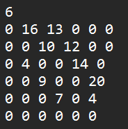
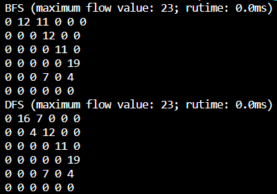

# Maximum Flow Calculation using Ford-Fulkerson Algorithm

## Table of Contents

- [Introduction](#introduction)
- [Requirements](#requirements)
- [Component Overview](#component-overview)
- [Algorithms](#algorithms)
- [Usage](#usage)
- [Input Format](#input-format)
- [How to Run](#how-to-run)
- [Example Input](#example-input)
- [Output](#output)
- [Contact Information](#contact-information)
- [Acknowledgments](#acknowledgments)


## Introduction

This program implements the Ford-Fulkerson algorithm to calculate the maximum flow in a given flow network. It provides an efficient way to compute flows in directed graphs with capacities and supports both Breadth-First Search (BFS) and Depth-First Search (DFS) for pathfinding.


## Requirements

- Python installed on your system


## Component Overview

- 'Graph Class': Represents the flow network. Handles operations like adding edges, printing the graph, and finding paths using BFS or DFS.

- 'List Class': A utility class for managing lists used in the Graph class.

- 'FordFulkerson Function': The core algorithm that calculates the maximum flow in the network using BFS or DFS.

- 'Main Function': Coordinates the flow of the program, including reading input, invoking the Ford-Fulkerson algorithm, and displaying results.


## Algorithms

The program implements the Ford-Fulkerson method which involves repeatedly finding augmenting paths from the source to the sink in the network and augmenting the flow along these paths. The process is repeated until no more augmenting paths can be found. The algorithm's efficiency depends on the method used to find the augmenting path, with options for BFS or DFS.


## Usage

**Prepare an `input.txt` file containing the flow network data:**

    - The first line should include a single integer indicating the number of vertices (n).

    - The following `n` lines should each contain `n` space-separated integers, representing the adjacency matrix of the graph. Each integer denotes the capacity of the edge between the vertices.


## Input Format

- Create an input file named "input.txt" in the same directory as the script.

- The file should start with the number of vertices (n), followed by an n x n matrix representing the weighted edges of the graph. Each line in the matrix should contain space-separated integers.


## How to Run

To find maximum flow value calculated using both BFS and DFS of a graph, follow these steps:

1. Create an input file in the specified format.

2. Running the Script
Open a terminal and navigate to the directory containing the script.

3. Review the output to see the BFS & DFS and its maximum flow value.

4. Interpret the Results: The output will be in the specified format, showing BFS & DFS and their maximum flow value.


## Example Input

Here's an example input file for a graph:



## Output

- The script outputs the maximum flow value calculated using both BFS and DFS.

- The runtime for both BFS and DFS algorithms is displayed.

- The residual flow graph, which is the graph after calculating the maximum flow, is printed.

- For example:
    ```
    BFS (maximum flow value: 23; runtime: 10ms)
    [Residual graph matrix after BFS]
    ```
    DFS (maximum flow value: 23; runtime: 15ms)
    [Residual graph matrix after DFS]




## Contact Information

Please [contact me](mailto:eet232189@iitd.ac.in) if you have any queries or comments.


## Acknowledgments
This script was developed using Python and utilizes the Ford-Fulkerson algorithm to find the maximum flow in a flow network.
Feel free to reach out if you have any questions or need further assistance!